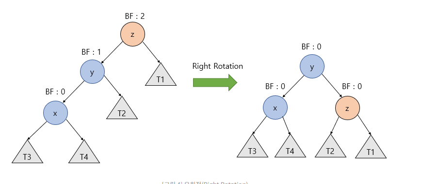
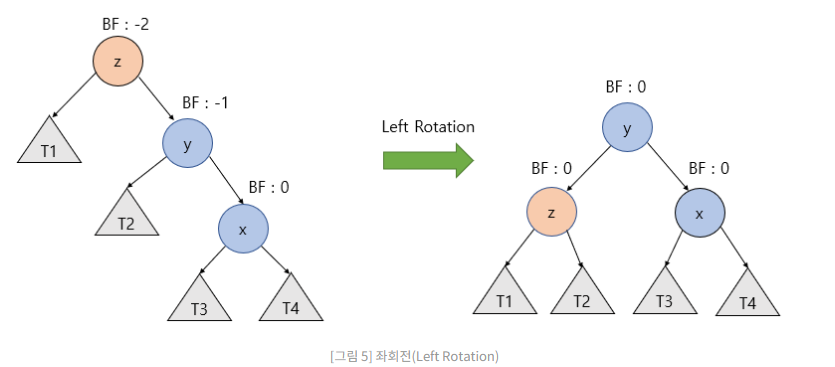
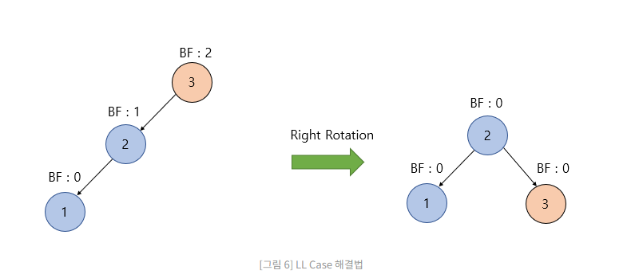
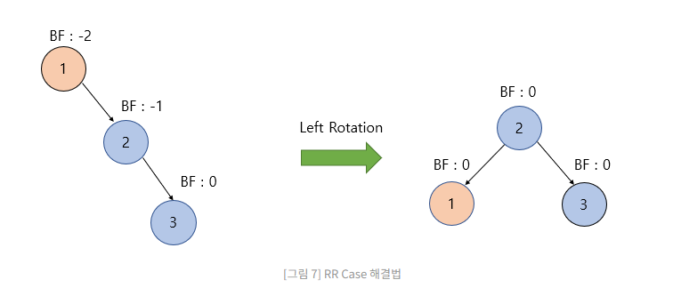
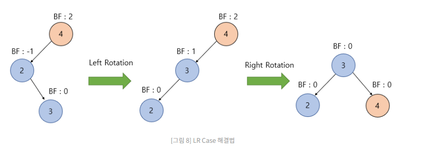
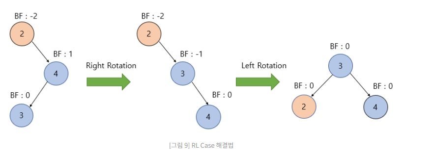

# AVL 트리

## AVL트리의 개념

기존 트리같은 경우 쏠려있는 경우 트리 탐색에 시간이 최악의 경우 $O(N)$ 걸리는 경우가 있다

이러한 점을 해결하기 위해 AVL 트리는 자체적으로 균형을 맞추어서 탐색에 $O(logN)$걸리게 한다.

## AVL 트리의 특징

1. 어떤 노드라도 왼쪽 서브트리와 오른쪽 서브트리의 높이 차이가 1보다 크지 않다.
2. 노드를 추가하거나 삭제했을때 높이차이가 1보다 커지는 경우가 생긴다면 재쟁럴한다.
3. 균형트리이다.
4. 왼쪽 서브트리의 높이와 오른쪽 서버트리의 높이의 값은 {1,0,-1}이다.
5. 

## 균형을 잡는 기준

AVL 트리는 모든 자식 서브트리의 높이가 최대 1만큼 차이나게 설계를 해야하고 이를 위반했을 경우 트리의 회전이 일어나게 된다.

## AVL 트리의 회전 

- 우회전 : 
1. Y노드의 오른쪽 자식 노드를 Z노드로 변경한다.
2. z노드 왼쪽 자식 노드를 오른쪽 서브트리로 바꾼다.

 좌회전 : 

1. y노드의 왼쪽 자식 노드를 z노드로 바꾼다.
2. z를 y노드의 왼쪽 자식노드로 바꾼다.

## AVL 트리의 4가지 회전

### LL 회전 

높이가 -1~1 을 벗어난 노드를 기준으로 왼쪽왼쪽 노드가 존재하면 우회전을 한다.

### RR 회전

오른쪽 오른쪽 노드가 존재한다면 노드를 기준으로 좌회전을 한다.

### LR 회전

1. 노드를 기준으로 왼쪽 오른쪽 노드가 존재한다면 높이에 이상이 있는 자식노드를 기준으로 좌회전을 한다.
2. 그 후 이상이 있는 노드를 기준으로 우회전을 한다.

### RL 회전

1. 높이에 이상이 있는 노드 기준으로 오른쪽 , 왼쪽 노드가 존재한다면 이상이 있는 노드의 자식 노드를 기준으로 우회전을 한다.
2. 그 후 좌회전을 한다.

