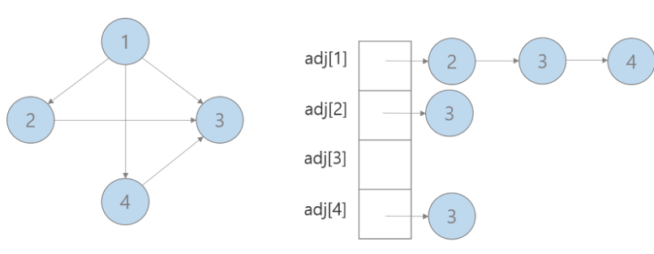
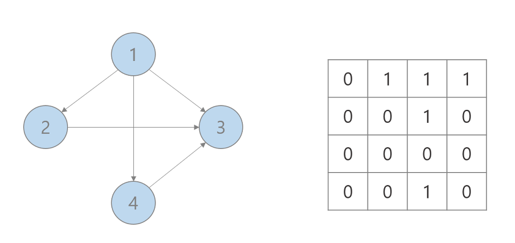

# 그래프

노드와 그 노드를 연결하는 간선들을 모아놓은 자료구조

# 그래프의 용어
- 정점(vertex): 위치라는 개념. (node 라고도 부름)
- 간선(edge): 위치 간의 관계. 즉, 노드를 연결하는 선 (link, branch 라고도 부름)
- 인접 정점(adjacent vertex): 간선에 의 해 직접 연결된 정점
- 정점의 차수(degree): 무방향 그래프에서 하나의 정점에 인접한 정점의 수
- 무방향 그래프에 존재하는 정점의 모든 차수의 합 = 그래프의 간선 수의 2배
- 진입 차수(in-degree): 방향 그래프에서 외부에서 오는 간선의 수 (내차수 라고도 부름)
- 진출 차수(out-degree): 방향 그래픙에서 외부로 향하는 간선의 수 (외차수 라고도 부름)
- 방향 그래프에 있는 정점의 진입 차수 또는 진출 차수의 합 = 방향 그래프의 간선의 수(내차수 + 외차수)
- 경로 길이(path length): 경로를 구성하는 데 사용된 간선의 수
- 단순 경로(simple path): 경로 중에서 반복되는 정점이 없는 경우
- 사이클(cycle): 단순 경로의 시작 정점과 종료 정점이 동일한 경우 

## 그래프의 종류

- 무방향 그래프 : 간선에 방향이 없고 모든 방향으로 갈 수 있다.
- 방향 그래프: 간선에 방향이 존재해서 한 방향으로만 갈 수 있다.

## 연결그래프 vs 비연결 그래프
- 연결그래프 : 무방향 그래프에 있는 정점쌍에 대해서 항상 경로가 존재하는 경우.
- 비 연결 그래프 : 무방향 그래프에서 특점 정점 사이에 경로가 존재 하지 않는 경우

## 완전그래프

- 그래프에 속해 있는 모든 정점이 서로 연결되어 있는 그래프

## 그래프의 구현 방법

### 인접 리스트

인접 리스트는 그래프의 연결 관계를 리스트로 나타내는 것이다.

> adj[i]: 노드 i에 연결되어 있는 노드들의 인덱스를 저장한 리스트

- 장점 : 연결되어 있는 노드들만 저장하므로 메모리 관리가 효율적이다.
- 단점 : 연결되어 있는 특정 노드들끼리 연결 조회를 하는데 시간이 오래걸린다.

### 인접 행렬

> adj[i][j] : 노드 i에서 노드 j로 가는 간선이 있으면 1, 아니면 0

- 장점 : 특정 노드들끼리 연결 관계를 조회하기 쉽다.
- 단점 : 사용하지 않는 메모리 공간이 많다.
- 