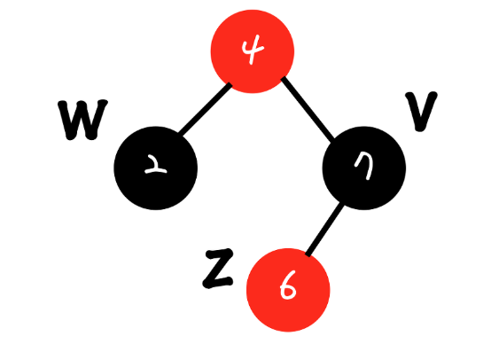

# Red - Black Tree

레드 블랙 트리는 자가 균형 이진 탐색 트리이다.

- 이진트리의 단점인 치우친 이진트리의 탐색이 O(N)인것을 보완해서 O(logN)으로 탐색한다.

## 레드 블랙 트리의 특징

1. 모든 노드는 빨간색 호은 검은색이다.
2. 루트 노드는 검은색 이다.
3. 모든 리프노드는 검은색이다.
4. 빨간색 노드의 자식은 검은색이다.
5. 모든 리프노드에서 루트노드로 까지는 경로에서 만나는 검은색 노드의 개수가 같다.
6. 새로운 노드는 모두 빨간색이다.

## 레드 블랙트리의 삽입

위 상태와 같을때 3을 삽입

1. 3은 2보다 크니 2의 오른쪽 노드로 삽입한다.
2. 새로운 노드는 빨간색 노드
3. 2개 연속 빨간색 노드는 불가능하다.

> 레드가 2개 연속일때는 이것을 해결시켜야 한다.

## Double red 해결 방법

## 1. Restructuring

현재 삽입된 노드 기준으로 부모노드의 형제노드 (삼촌 노드)의 색깔에 따라 결정 된다.

Restructuring의 과정

1. 나와 내 부모 내부모의 부모 노드를 오름차순으로 정렬
2. 가운데 있는 값을 부모로 만들고 나머지 둘을 자식 노드로 만든다.
3. 올라간 노드를 검정으로 만들고 두 자식노드를 레드로 만든다

노드 세개를 선택

1. 선택한 노드들을 정렬한다.

2. 가운데 노드를 부모노드로 만들고 자식노드들을 붙인다.

3. 부모 노드를 검정으로 바꾸고 자식노드를 레드로 바꾼다.

나머지 기존 4에 붙어있던 노드를 4에 붙인다.

## 2. ReColoring

1. 현재 노드(z) 의부모(v)와형제(w)를 검정으로 하고 조부모 노드를 빨강으로 한다.

색칠 후 결과

case 1 : 만약 조무보 노드가 루트 노드라면 검정으로 바꾼다.

case 2 : 만약 조부모 노드의 부모 노드가 레드라면 다시 Recoloring이나 Restructuring을 수행한다.

레드블랙트리는 삽입하는경우  시간복잡도가 O(logN)이다.

## 레드 블랙트리의 삭제

case 1: 삭제할 노드가 레드 : 노드 그냥 삭제

case 2: 삭제할 노드가 블랙

case 2-1: 

s노드의 자식노드가 모두 검정일경우 재조정이 필요하다

p노드와 s 노드의 색깔을 바꾸어주고 해결한다.

case 2-2: 전부다 블랙일경우

가운데 s노드의 색깔을 레드로 바꾼다.

case 2-3: 형제 노드가 black 오른쪽 자식 노드가 red 인경우

이때는 트리를 왼쪽으로 회전시키면 된다.

case 2-4: 형제노드의 왼쪽이 red 오른쪽이 black 인 경우

오른쪽으로 회전시킨다.

case 2-5: 형제노드가 red 인경우 

위와 같은 형태로 바꾼다

삭제 과정은 한번 삭제에 완전해지지 않을 수도 있으므로 재귀적으로 연산을 수행한다.

## 레드 블랙 트리 vs AVL 트리

1) 레드 블랙 트리
- 삽입 삭제시 균형을 맞추기 위한 작업 횟수가 적다.
- 색깔을 표현하는데 1bit의 공간만 있으면 된다.

2) AVL 트리
- 조회시 더 빠른 성능
- 노드에 색깔이 없다.
