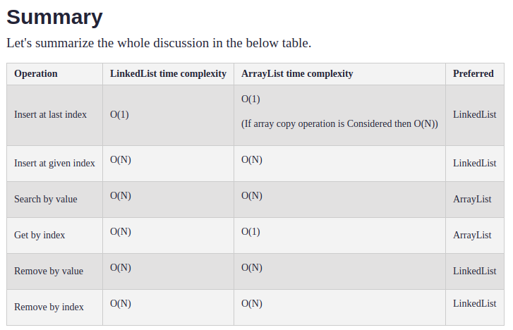
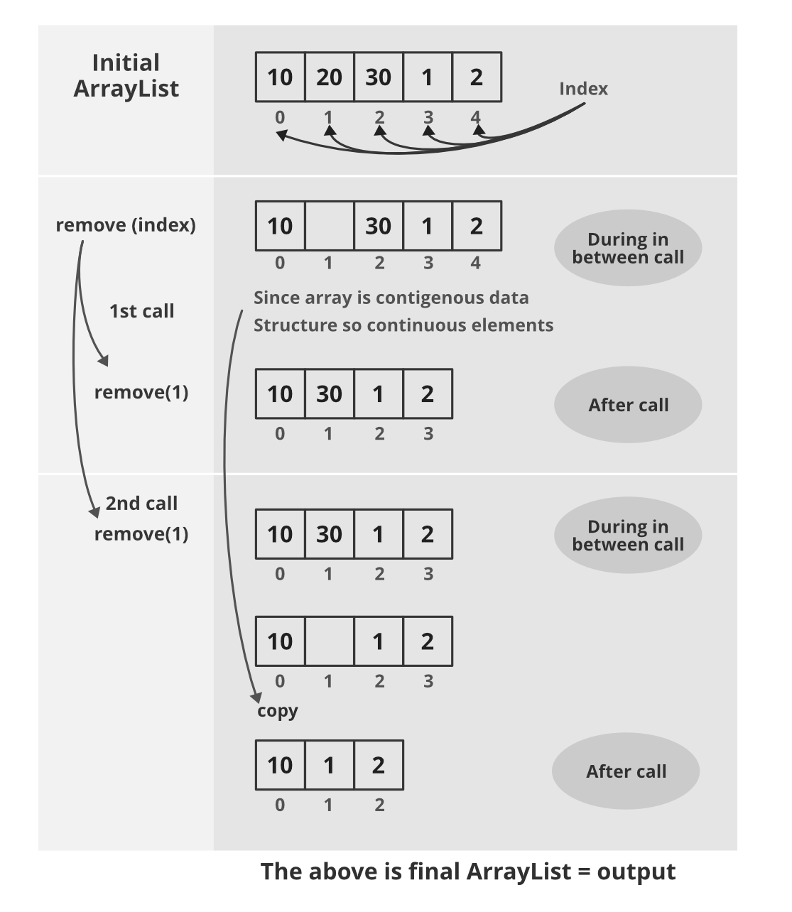

# Array

## 배열(Array)이란

연속된 메모리구조를 가지는 변수들의 모음

순서대로 번호가 붙은 원소들이 연속된 형태로 구성된 구조이다.

연속된 메모리 구조를 가져야 하기 때문에 배열을 늘리는것은 불가능하며 배열을 늘려야 하는 경우에는 새로운 배열을 만들고 새로운 배열에 기존의 값을 복사하는 방식을 주로 사용한다.

연속된 메모리 구조를 가지기 때문에 인덱스를 알면 데이터 접근이 항상 $O(1)$으로 상수시간을 보장한다.

## 배열 연산의 시간 복잡도



## 배열에서의 삭제 과정



Java ArrayList에서의 삭제 과정

```java
    private void fastRemove(Object[] es, int i) {
        ++this.modCount;
        int newSize;
        if ((newSize = this.size - 1) > i) {
            System.arraycopy(es, i + 1, es, i, newSize - i);
        }

        es[this.size = newSize] = null;
    }
```
1. ArrayList는 자체적으로 remove(Object o) 메서드를 가지고 있다.
2. remove 메서드 수행시 처음 인덱스 부터 순회를 하면서 삭제를 위한 객체가 있는지 확인한다.
3. 만약 있다면  내부의 fastRemove 메서드를 호출 해서 삭제한 데이터 다음 인덱스부터 한칸씩 땡겨서 복사를 한다.

## 배열에서의 삽입 과정

```java
public void add(int index, E element) {
        this.rangeCheckForAdd(index); // 인덱스가 올바른 값인지 검증
        ++this.modCount; // 루프중 변경횟수 감지 
        int s;
        Object[] elementData;
        if ((s = this.size) == (elementData = this.elementData).length) {
        elementData = this.grow(); // 삽입 과정 
        }

        System.arraycopy(elementData, index, elementData, index + 1, s - index); //삽입시 뒤에서부터 뒤로 값을 하나씩 땡기게 된다.
        elementData[index] = element;
        this.size = s + 1;
        }
```
1. add 메서드 수행시 뒤에서부터 값을 하나씩 복사해서 새로 저장을 하게 된다.
2. 저장을 하게되면 결과적으로 크기가 1증가한다.