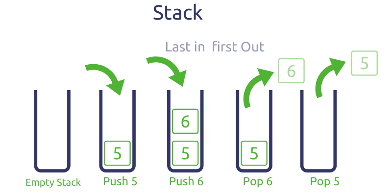

## 스택

리스트 계열의 자료구조의 일종으로 Last in First Out이 모토인 자료구조 이다.

자료의 삭제와 삽입이 항상 리스트의 맨 뒤에서 이루어진다.

맨뒤에서 이루어지기 때문에 삽입과 삭제의 시간복잡도는 O(1)을 보장한다.

## Java Stack collection

- empty() : Stack이 비어있는지 여부에 대해 boolean 값 반환
- push(E item) : Stack에 데이터를 삽입하고, 삽입한 데이터를 반환하는 메소드
- pop() : Stack의 최상위 데이터를 삭제하고, 삭제한 데이터를 반환하는 메소드
- peek() : Stack의 최상위 데이터를 반환하는 메소드
- search(Object o) : 파라미터로 들어온 데이터의 인덱스를 반환하는 메소드