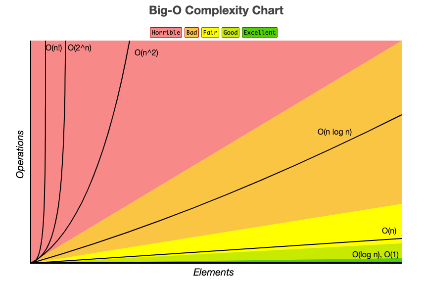

# 시간복잡도

## 시간복잡도

시간 복잡도는 알고리즘을 수행하는데 연산들이 몇 번 이루어지는 지를 식으로 표기 하는 것.

시간복잡도를 계산 할 때에는 변하지 않는 상수는 계산하지 않고 가변적인 데이터의 입력을 기준으로 계산한다.

시간 복잡도는 3가지 경우로 나타낼 수가 있다.
1. 최선의 경우 : 
- 알고리즘이 이상적으로 수행 될 때 걸리는 최소한의 시간 
- 현실적으로 데이터가 항상 이상적인 상황은 거의 없어서 잘 사용하지 않는다.
2. 최악의 경우:
- 시간 복잡도라고 얘기하면 보통 최악의 경우를 말한다.
- 알고리즘을 수행할때 이 시간보다는 덜 걸릴린다.
- 시스템은 최악의 경우를 생각해서 보수적으로 설계 해야 하므로 주로 최악의 경우를 계산한다.
3. 평균적인 경우 :
- 모든 입력이 발생할 확률을 고려했을때 걸리는 평균 수행 시간.

## 빅오 표기법

최악의 시간복잡도를 계산 할 때 계산하는 식

최악의 시간복잡도를 계산 할때 가장 차수가 높은 항빼고는 상수처리해서 없는것처럼 취급한다.
$$
TimeComplexity(n) = n^2+2n+1
$$
일경우 가장 차수가 높은 $n^2$빼고는 다 지워서 간단하게 O($N^2$)이라고 표기한다.
### O(1)

시간복잡도가 O(1)이 걸리는 경우는 데이터의 입력과 상관없이 걸리는 시간이 일정한 경우를 말한다.

ex) 
- 데이터의 할당 연산자 (=)
- 배열의 index 접근
- print()
- 해시의 데이터 삽입 , 삭제

### O($logN$)
시간복잡도가 $logN$가 걸리는 경우는 logN에 비례해서 증가하는 경우가 있다.
ex)
- 이진 검색 트리의 탐색
- 세그먼트 트리의 insert, query ,update
- 우선순위 큐의 삽입과 정렬

### O($N$)

시간복잡도가 입력 데이터에 비례해서 증가하는 경우 

- 배열의 완전 탐색
- 배열의 삽입과 삭제
- 일반적인 for i 반복문의 순회

### O($NlogN$)
- 데이터의 정렬

### O(%N^2$)
- 일반적인 이중 for loop

### 백준에서의 입력 크기별 최대 시간 복잡도
보통 1억번의 연산을 할때 1초라고 계산을 하고 문제를 풀것
- $O(N)$ , $N>=1,000,000$
- $O(NlogN)$ , $N>=100,000$
- $O($N^2$) , $N<=10,000$
- 



# 공간복잡도

작성한 프로그램이 입력에 따라 얼마나 많은 메모리를 잡아먹는가에 관한 다항식

마찬가지로 빅오 표기법을 사용하며 프로그램에서 사용하는 변수들에 따라 달라진다

가장 쉬운 예시로 
```java
int [] arr = new int[n][n]
```
일경우 배열 arr이 n^2이므로 공간복잡도는 $O(N^2)$이다.

int 원소 하나당 4byte 이므로

n이 1000이라고 가정하면

4 * 1000 * 1000 // 1024 // 1024 = 3.8MB가 나오게 된다.
