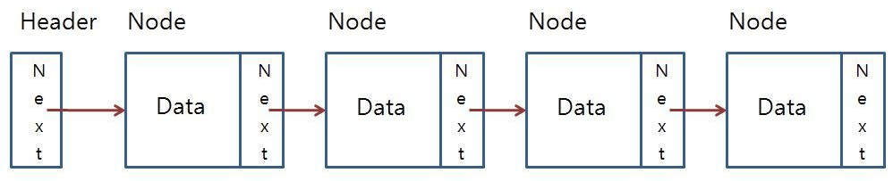

# LinkedList



배열과 다르게 객체들간의 연결을 이용해서 리스트를 구현한것

배열의 접근은 메모리를 이용해서 접근을 했었지만 연결 리스트는 객체 내부에서 다음 객체를 지정하고 이를 통해서 다음 데이터에 접근을 할 수 있다.

## Java에서의 LinkedList

```java
LinkedList<Integer> list=new LinkedList<>();
list.add(5); // 원소 하나를 저장
list.add(3,5); // 인덱스에 원소를 저장
list.addFirst(1); // 맨앞에 저장
list.addLast(1); // 맨끝에 저장
list.contains // 있는지 확인
list.remove(3) // 인덱스로 삭제


```
연결 리스트의 선언은 일반 collection 객체들과 다르지 않다.

내부적으로 삽입과 삭제 메서드를 지원한다.


## LinkedList의 내부 연산

- 삭제 : 삭제하기 위해 값을 찾아야 하는 탐색이 일어나므로 $O(N)$ 시간이 걸린다 만약 정확히 노드를 알고 있다면 $O(1)$에 해결 할 수 있다.
- 삽입 : 삭제와 마찬가지로 값을 찾아야 한다. 끝과 처음이라면 항상 O(1)시간이다.
- 조회 : 인덱스를 처음부터 탐색해야 하므로 $O(N)$ 시간이 걸린다.

## LinkedList가 유리한 경우

- 삽입을 할 때 배열 크기를 넘게 된다면 다시 배열을 생성하고 복사 해야하는데 연결 리스트는 항상 O(1) 시간에 해결이 가능하다.
- 연속적으로 값을 삭제하거나 추가하는 경우 , 한번 인덱스를 찾으면 그때부터는 $O(1)$ 시간에해결이 가능하다


## LinkedList의 구현
```java


class LinkedList {
    Node head; // head of list
 
    /* Linked list Node*/
    class Node {
        int data;
        Node next;
 
        // Constructor to create a new node
        // Next is by default initialized
        // as null
        Node(int d) { data = d; }
    }
}
```

Q1. LinkedList의 삽입 삭제를 위 코드를 가지고 구현을 해라.

## LinkedList 관련 문제

[백준 줄세우기 브론즈 3](https://www.acmicpc.net/problem/2605)

[카카오 21 인턴 ](https://school.programmers.co.kr/learn/courses/30/lessons/81303)
