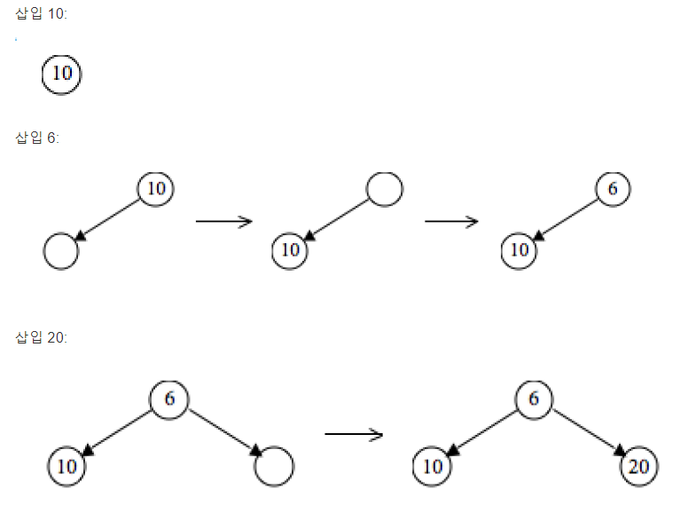
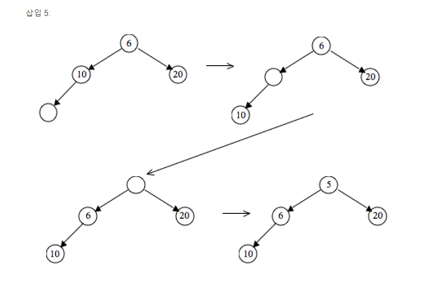
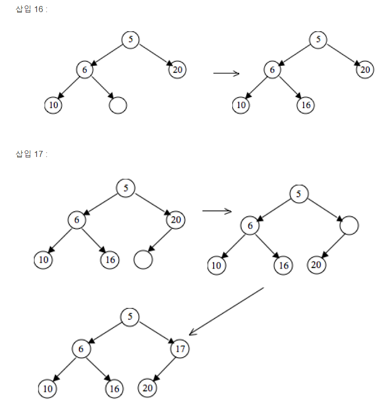
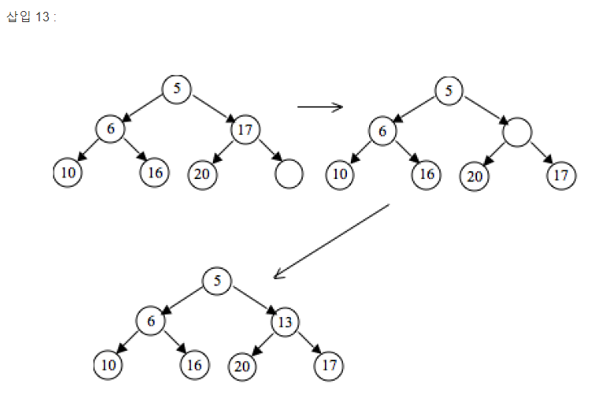
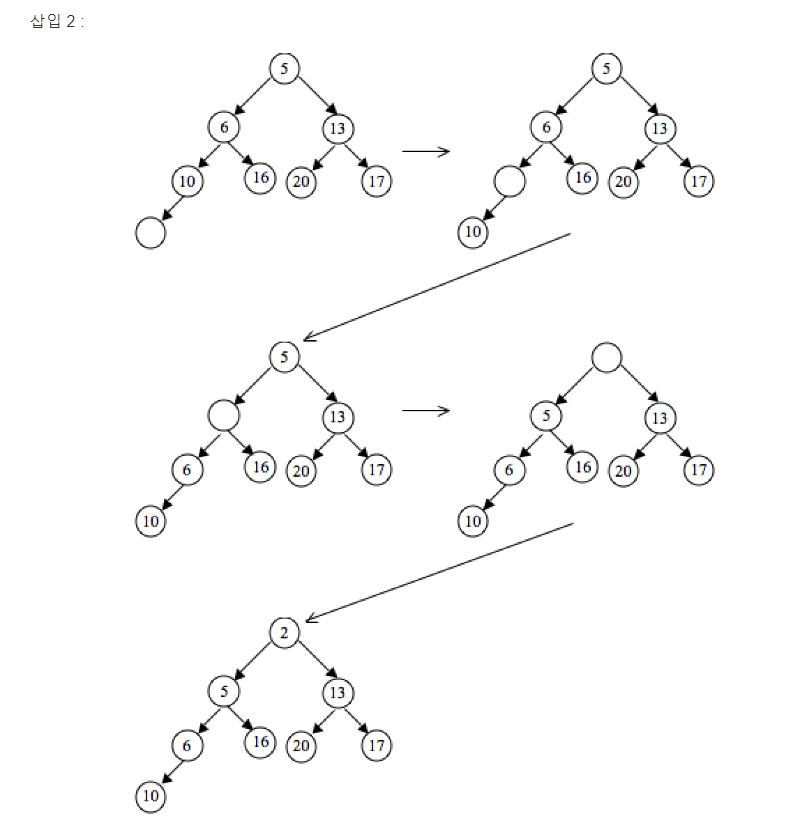
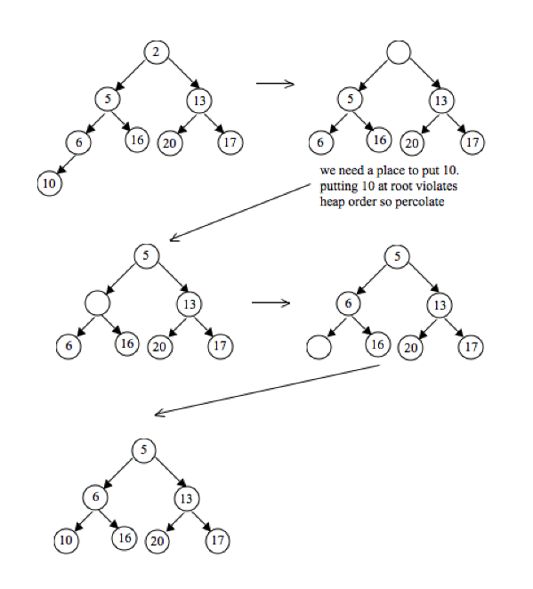

# binary heap

이진 힙은 이진 트리의 형태를 취하는 힙 데이터 구조

이진 힙은 우선 순위 큐를 구현하는 가장 일반적인 방법중 하나이다.

## 이진 트리의 특징

- 이진 힙은 완전한 이진트리이다. 마지막 레벨을 제외한 모든 노드의 자식들이 채워진다.
- 각 노드에 저장된 키는 자식에 있는 키보다 크거나 같거나 작거나 같다.

## 이진 힙의 시간복잡도

| 알고리즘   | 평균     | 최악        |
|--------|--------|-----------|
| 공간복잡도  | $O(N)$ | $O(N)$    |
| 검색     | $O(N)$ | $O(N)$    |
| 삽입     | $O(1)$ | $O(logN)$ |
| 최소값 탐색 | $O(1)$ | $O(1)$    |
|최소값 삭제|$O(logN)$|$log(N)$|

이진 힙은 최소 힙, 최대 힙으로 구현하냐에따라서 노드의 우선순위가 바뀌게 된다.

## 이진 힙의 삽입 과정
10,6,20,5, 16, 17, 13,2 을 순서대로 삽입
- 먼저 들어갈 노드의 공간을 만들고 데이터를 추가한다.
- 힙 규칙을 위반하지 않는다면 그대로 둔다
- 규칙을 위반하면 부모노드로 계속올라가면서 규칙을 만족할떄까지 올라간다
- 

## 이진 힙에서 삭제

이진 힙에서 삭제는 루트 노트를 제거하는 작업이다.

- 루트 노트를 제거한다.
- 레벨이 가장 높은 노드를 루트 노드로 올리게 된다.
- 트리의 규칙에 맞게 재배열 한다.

