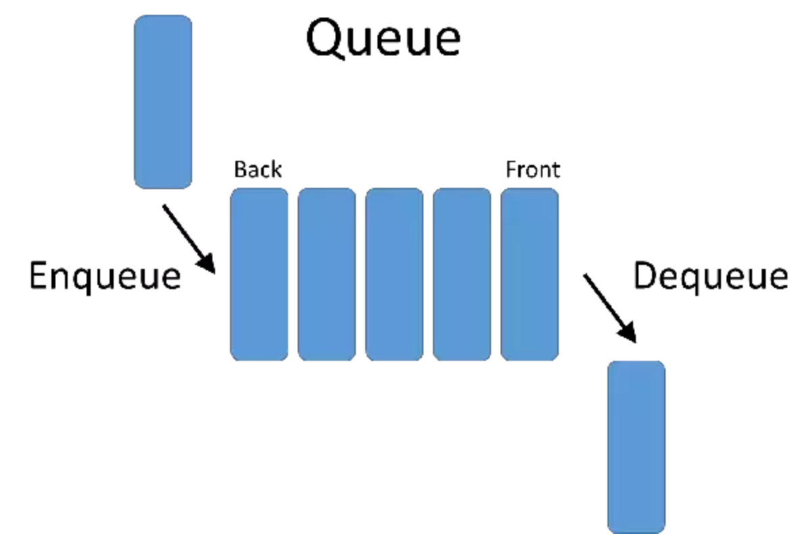
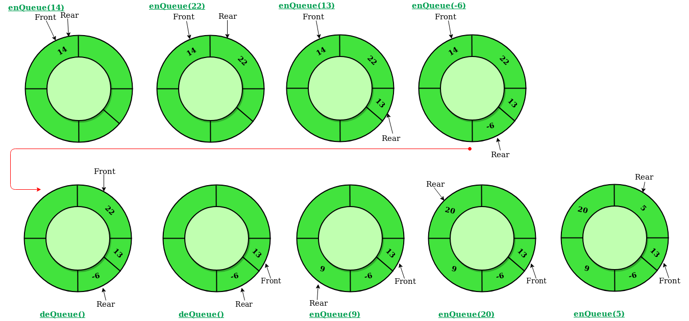
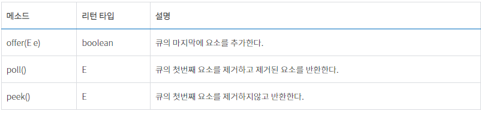

# Queue

큐는 리스트 자료구조의 일종으로 먼저 넣은 자료가 가장 먼저 나오게 되는 First in First Out 구조 이다.

enqueue 작업은 리스트의 맨 마지막에 원소를 삽입하는 연산이다.

dequeue 작업은 리스트의 맨 앞에 있는 원소를 제거하는 연산이다.

각각의 연산의 시간 복잡도는 항상 O(1)의 시간을 보장한다.

## 스택과의 차이점

큐와 스택과의 차이점은 head를 자료구조 내에서 바로보고 있냐 아니냐 하는 차이이다.
stack에서는 맨뒤에서만 작업이 이루어지므로 맨 앞을 참조할 이유가 없으나

queue에서는 맨 앞에서 dequeue 하는 과정을 수행 해야 하므로 queue는 front를 가지고 있다.

## Queue의 문제점
- 삽입과 삭제를 반복하게 되면 배열로 구현을 한 경우 앞에 삭제를 한 값은 공간이 비어있는 공간이 되어 메모리 낭비가 일어나게 된다.

## 원형 큐

기존 큐의 단점을 해결 할 수 있다.

원형 큐는 rear가 끝에 도달 했을 경우 다시 맨앞의 인덱스를 rear로 해서 남는 공간없이 계속해서 반복적이게 사용 할 수 있다.

성능 저하가 없고 구현이 [index + 1 % queue.size()]로 구현을 하면 계속해서 순환하게 만들수 있다.

## 우선 순위 큐

어떠한 우선 순위를 기반으로 정렬 되어있는 큐이다.

- Dequeue 작업을 할 때 항상 우선순위가 제일 높은 원소가 삭제가 된다.
- Enqueue 작업을 할 때 원소의 값이 우선순위에따라 정렬이 된다.

삽입 , 삭제 , 우선순위 큐로 변형이 O(logN)시간이 걸리게 된다.

## Java에서의 queue

