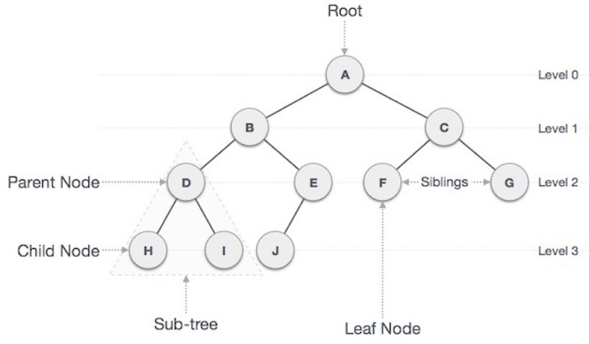

# 트리

## 트리의 개념

트리는 노드로 이루어진 계층형 자료구조

1. 트리는 하나의 루트 노드를 가진다.
2. 루트 노드는 자식 노드를 가진다.
3. 자식 노드는 다시 자식노드를 가진다.

트리는 노드들과 그 노드들을 연결하는 간선들로 구성이 되어있다.

## 트리의 용어

- 루트 노드(root node): 부모가 없는 노드, 트리는 하나의 루트 노드만을 가진다.
- 단말 노드(leaf node): 자식이 없는 노드, ‘말단 노드’ 또는 ‘잎 노드’라고도 부른다.
- 내부(internal) 노드: 단말 노드가 아닌 노드
- 간선(edge): 노드를 연결하는 선 (link, branch 라고도 부름)
- 형제(sibling): 같은 부모를 가지는 노드
- 노드의 크기(size): 자신을 포함한 모든 자손 노드의 개수
- 노드의 깊이(depth): 루트에서 어떤 노드에 도달하기 위해 거쳐야 하는 간선의 수
- 노드의 레벨(level): 트리의 특정 깊이를 가지는 노드의 집합
- 노드의 차수(degree): 하위 트리 개수 / 간선 수 (degree) = 각 노드가 지닌 가지의 수
- 트리의 차수(degree of tree): 트리의 최대 차수
- 트리의 높이(height): 루트 노드에서 가장 깊숙히 있는 노드의 깊이

## 트리의 특징

1. 트리의 노드가 N개일 경우 간선의 개수는 N-1개이다.
2. 루트노드에서 어떤 한 경로로 가는 경로는 하나이다.

## 이진 트리

자식의 개수가 최대 2개인 트리의 형태

## 이진 트리의 종류

- 완전 이진 트리 : 트리중 마지막 레벨을 제외한 모든 노드의 자식 개수가 전부 2개인 트리
- 포화 이진 트리 : 마지막 레벨까지 모든 자식노드가 다 채워진 경우 이 경우 모든 노드의 개수는 $2^level -1 $이다.
