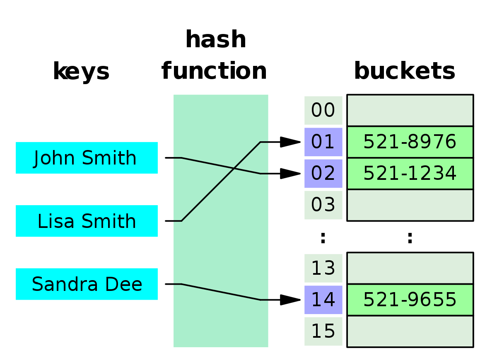
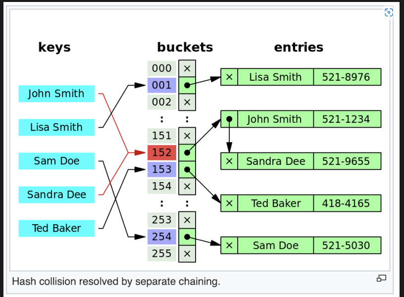
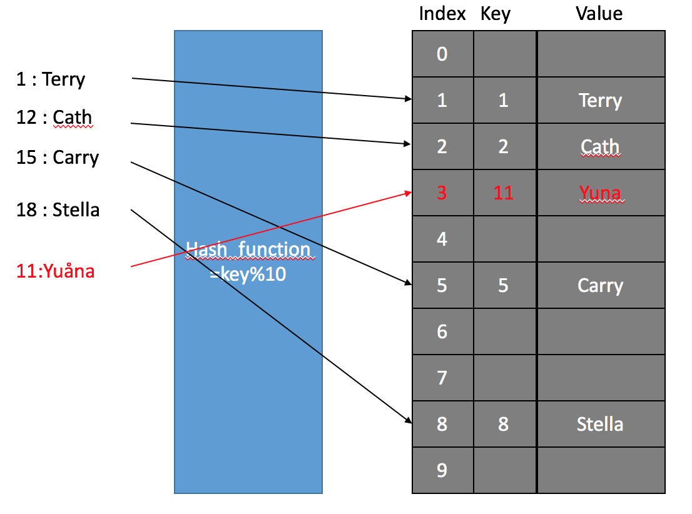
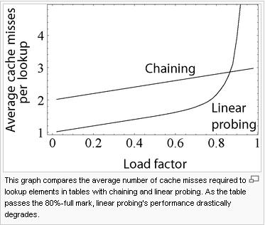
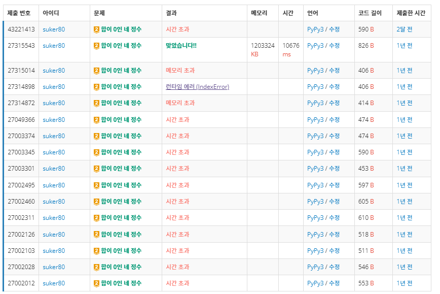

# Hash

> Hash table: key를 value에 매핑하는 array 형태의 자료구조

우리가 흔히 해시라고 부르는 자료구조는 엄밀히 말하면 해시 테이블(Hash table), 또는 해시 맵(Hash map)을 뜻한다. 여기서 hash는 해시 함수를
말한다.

## 해시 테이블의 원리

1. input으로 key를 받고 Hash 함수를 통해 key를 암호화한다.
2. 암호화한 key를 가지고 해시 테이블 배열을 만들고 값을 저장한다.

## 해시의 장점 
- Key를 가지고 O(1) 시간에 접근이 가능하다.

## Hash Key

주로 사용자의 입력데이터를 가지고 사용을 한다.

## Hash function

해시 키를 가지고 해시 함수를 통해서 가변길이의 input을 고정된 길이의 input으로 바꾸게 된다.
hash 함수를 사용하면 같은 입력은 항상 같은 출력 값이 나오게 된다.

해시 함수의 예로는 MD5, SHA계열 해시 함수들이 있다.

## hashCode()?

자바에서의 hashCode() 함수는 객체를 해시 함수를 통해서 객체의 고유한 해시코드를 생성해낸다.
Object.equals()는 두 객체의 해시코드를 비교해서 값이 같으면 두 객체가 같다고 판단을 한다.

## 해시에서의 충돌

가끔 서로 다른 key를 넣어도 해시 값이 같은 경우가 있다. 이럴 때는 해시 값이 충돌했다고 한다.

해시값이 충돌할때는 이를 해결을 해야하는데 2가지 방법이 있다.

## Separate Chaining

해시 테이블이 충돌이 일어났을때는 충돌 된 인덱스 끼리 서로 값을 연결해서 연결리스트로 구현을 한다.
만약 충돌한 값을 찾는 경우에는 먼저 테이블을 조회하고 버켓에 연결되어 있는 연결리스트 중에서 값을 찾는다

이 경우에는 최악의 경우 O(N) 시간이 걸릴 수도 있다.

Java와 Python은 해시 충돌시 이 방식을 사용하며

Java의 경우에는 처음에 연결리스트로 8개가 쌓이게 되면 Red Black Tree로 바꾸어서 저장을 하게 된다

Red Black Tree는 탐색의 경우 O(logN)의 시간으로 탐색을 할 수 있어서 성능 최적화를 하였다.

## Open Addressing

오픈 어드레싱 방식은 해시 충돌이 일어나면 충돌을 해결하기 위해 남는 자리를 탐색하고 
남는 공간이 있으면 그 공간에다가 삽입하는 방식이다.

위 그림과 같이 테이블 1 인덱스에 삽입을 하려는데 충돌이 일어나서 비어있는 공간인 3번 인덱스에 값을 저장을 했다.

## Open addressing vs Separate Chaining

Separate chaining의 장점

1. 효과적으로 구현하기 간단하고 기본적인 자료구조 지식만 있으면 된다.
2. 테이블이 채워져도 성능저하가 선형적이게 증가한다.

open addressing 의 장점

1. 포인터도 저장할 필요가 없고 추가적인 저장 공간이 필요 없어서 메모리 효율이 높다.
2. 삽입시 메모리 할당 오버헤드가 없으며 메모리 할당자가 없어도 구현이 된다.
3. 추가 연결리스트 같은 작업이 요구 되지 않는다.

> open addressing은 테이블에 모두 저장 할 수 있고 크기가 작을 수록 성능이 좋다
> chaining의 방식은 데이터가 크거나 가변적일때 훨씬 더 성능이 좋다.

> 해시 테이블은 데이터가 많을 경우 충돌을 고려해서 설계를 해야한다. 알고리즘 문제를 풀면서 해시를 가장 많이 쓸텐데 데이터가 많아서 충돌이 나는지
> 안 나는지 판단을 할수 있어야 한다.

이론상 시간복잡도가 문제가 되지않지만 해시 테이블 충돌이 있으면 시간초과가 날 수 있다.
